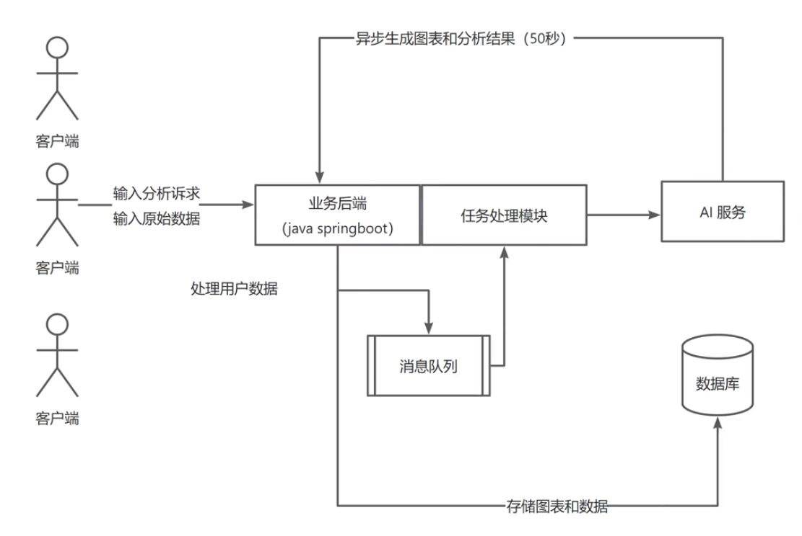
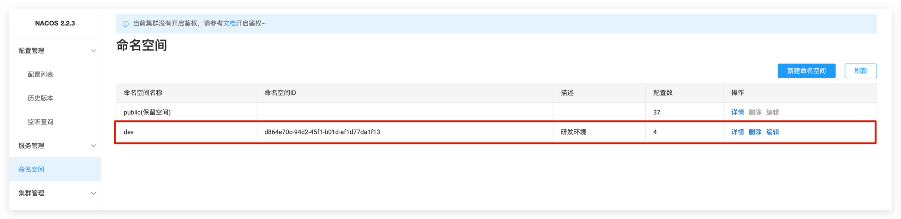
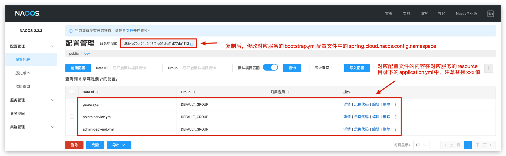

<h1 align="center">DataLoom</h1>
<p align="center"><strong>DataLoom is an intelligent, visual data governance and analysis platform for users 🛠</strong></p>
<div align="center">
<a target="_blank" href="https://github.com/Hardork/hwqbi-backend">
    
</a>
<a target="_blank" href="https://github.com/Hardork/hwqbi-backend">
    
</a>
    
<a target="_blank" href="https://www.oracle.com/technetwork/java/javase/downloads/index.html">
        
</a>
    
<a href="https://github.com/Hardork/hwqbi-backend" target="_blank">
    
</a>
</div>

> Author: [Hardork](https://github.com/Hardork)
> Contributor: [RookieeZhang](https://github.com/RookieeZhang)
> For project issues or questions, please contact:
> Email: hardork@163.com
> WX: _hardork

## Project Background
<strong>
    Traditional data visualization platforms often have shortcomings, such as requiring users to have some technical knowledge, which increases the technical barrier. A complete data visualization process typically includes multiple steps such as data cleaning, analysis, and visualization, making it complex to operate. DataLoom differs from traditional platforms by allowing users to upload data sources (supporting MySQL, APIs, Excel, etc.) and automatically identifying high-value data from metadata. The system uses LLM models for automated analysis, while also supporting user-defined analysis goals.
</strong>

## Key Features

- **Multi-data source upload**: Users can import different data sources into the system, convert them into a unified storage format, and extract data using manual table joins or custom SQL queries.
- **Collaborative data sharing**: Users can share generated datasets with others, enabling collaborative development and analysis, improving team efficiency.
- **Automated dataset generation**: DataLoom uses LLM models to automatically analyze metadata from uploaded data sources, identify high-value information, and generate previews based on user analysis needs, which can be saved as datasets, simplifying the data processing workflow.
- **Intelligent dashboards**: Based on automated data analysis, DataLoom can generate highly customized visual dashboards, helping users quickly gain insights.
- **Points system**: Users can earn points by completing specific tasks on the platform, which can be redeemed for services or features, increasing user engagement.
- **Coupon module**: The platform provides various discounts and rewards through a coupon system, encouraging user participation and increasing activity. Supported coupon types include discount coupons, free service coupons, and double points coupons.

## Technology Stack 🎯

### **Backend**
- Spring Boot 2.7.0
- Spring MVC
- Spring Cloud Alibaba 2021.0.4.0
- Nacos (for registration and configuration)
- MySQL database
- RocketMQ (message queue)
- XXL-Job (distributed task scheduling)
- Redis (cache)
- WebSocket (bi-directional communication)
- Tencent Cloud COS (object storage)
- Swagger + Knife4j (API documentation)
- Jakarta.Mail (for email notifications, verification codes)
- Apache Commons Lang3 (utility library)
- MyBatis-Plus and MyBatis X (code generation)
- Hutool, Apache Common Utils (utility libraries)

### Frontend

- React 18
- Ant Design Pro 5.x (scaffold)
- Ant Design & Procomponents (UI component library)
- Umi 4 (frontend framework)
- OpenAPI (for frontend code generation)

## Project Navigation 🧭
Github:
- [**DataLoom Backend 🏘️**](https://github.com/Hardork/hwqbi-backend)
- [**DataLoom Frontend 🏘**️](https://github.com/Hardork/hwqbi-frontend)

Gitee:
- [**DataLoom Backend 🏘️**](https://gitee.com/huang-wenqing-123/DataLoom)

## Directory Structure 📑

### Root Directory

| Directory                                                        | Description   |
|------------------------------------------------------------------|---------------|
| **[admin-backend](./admin-backend)**                             | Admin service |
| **[db-engine](./db-engine)**                                     | Data engine service |
| **[framework](./framework)**                                     | Common modules |
| **[gateway](./gateway)**                                         | Gateway service |
| **[points-service](./points-service)**                           | Points & coupon service |

### src/main/java Directory

| Directory                                                         | Description       |
|-------------------------------------------------------------------|-------------------|
| **[annotation](./src/main/java/com/hwq/dataloom/annotation)**      | Custom annotations |
| **[aop](./src/main/java/com/hwq/dataloom/aop)**                    | AOP module        |
| **[dataloomzmq](./src/main/java/com/hwq/dataloom/bizmq)**          | Message queue     |
| **[common](./src/main/java/com/hwq/dataloom/common)**              | Common module     |
| **[config](./src/main/java/com/hwq/dataloom/config)**              | Configuration     |
| **[constant](./src/main/java/com/hwq/dataloom/constant)**          | Constants         |
| **[controller](./src/main/java/com/hwq/dataloom/controller)**      | Controllers       |
| **[exception](./src/main/java/com/hwq/dataloom/exception)**        | Custom exceptions |
| **[job](./src/main/java/com/hwq/dataloom/job)**                    | Scheduled jobs    |
| **[manager](./src/main/java/com/hwq/dataloom/manager)**            | Services and middleware |
| **[mapper](./src/main/java/com/hwq/dataloom/mapper)**              | Mappers           |
| **[model](./src/main/java/com/hwq/dataloom/model)**                | Models            |
| **[service](./src/main/java/com/hwq/dataloom/service)**            | Services          |
| **[utils](./src/main/java/com/hwq/dataloom/utils)**                | Utility classes   |
| **[websocket](./src/main/java/com/hwq/dataloom/websocket)**        | WebSocket         |

## Architecture & Core Workflow 🗺️

### Architecture Design

### **Automated Dataset Generation**

### AI Analysis Service


## Quick Start 🚀

### Frontend

Requirements: Node.js >= 16

**Install dependencies:**

```bash
yarn or npm install
```

Start:

```bash
yarn run dev or npm run start:dev
```

Deploy:

```bash
yarn build or npm run build
```

### Backend
Please ensure you have the following middleware:
- MySQL
- RocketMQ
- Redis
- XXL-JOB
- Nacos

1. Execute create_table.sql and create_datasource_database.sql located in the sql directory.
2. Replace the placeholder values in the application.yml configuration file.
3. Create a namespace dev in Nacos.
   
4. Add a new configuration file in the Nacos configuration management list.
   
5. Add the startup environment variable, nacos-server = xxx.xxx.xxx.xxx (Nacos address).
   

## License
[MIT](https://choosealicense.com/licenses/mit)

## Contributing
If you find any issues or errors in the project or want to improve it, you can report issues or submit Pull Requests in the following ways:

- Open an Issue detailing your problem or request.
- you have code to fix the issue, you can create a Pull Request by modifying code in a new branch and merging it into the main branch.

Thank you for contributing to the project!