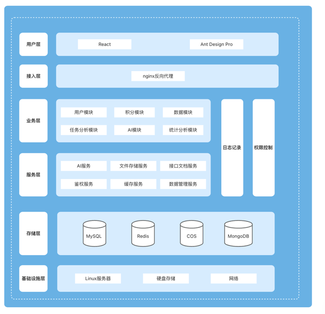

<h1 align="center">AI数据可视化平台</h1>
<p align="center"><strong>AI数据可视化平台是一个为用户提供智能化、可视化的数据分析平台 🛠</strong></p>
<div align="center">
<a target="_blank" href="https://github.com/Hardork/hwqbi-backend">
    
</a>
<a target="_blank" href="https://github.com/Hardork/hwqbi-backend">
    
</a>
    
<a target="_blank" href="https://www.oracle.com/technetwork/java/javase/downloads/index.html">
        
</a>
    
<a href="https://github.com/Hardork/hwqbi-backend" target="_blank">
    
</a>
<a href="https://github.com/Hardork/hwqbi-backend" target="_blank">
</a>
</div>

> 作者：[老山羊](https://github.com/Hardork)


## 项目背景
<strong>
传统数据可视化平台存在一些明显的缺点。首先，它们通常更像一个基于数据查询的数据展示工具，而不仅仅是一个数据分析工具。其次，处理不规范数据和转化复杂模型往往比较困难。此外，这些平台常常无法有效地处理大量数据，并且在网络连接方面，尤其是Online版的速度，可能会较慢。另外，传统数据可视化平台通常需要用户具备一定的技术知识，因此对用户的技术要求较高，学习成本也较大。一次完整的数据可视化过程包括数据获取、数据清洗、数据分析、数据可视化等多个步骤，操作起来较为复杂。</br>
AI数据可视化平台区别与传统的数据可视化平台，在本项目中，用户只需要导入excel原始数据集，并输入自己的分析诉求，比如你传入网站的用户增长表，描述你想分析的内容比如分析用户增长的规律；就能利用AI自动生成可视化图表和分析结论，降低用户操作的复杂度，并且实现了数据分析的降本增效，此外用户可以在“历史分析中”，查看已有的分析结果，集中管理🛠</strong>


## 项目功能介绍

- **智能图表分析**，上传excel数据文件，以及分析诉求即可，获取数据图表与AI分析报告
- **历史分析管理**，用户可以查看并管理历史分析报告
- - **数据协同**，用户可以将上传的数据集进行共享进行数据的协作开发
- **AI分析助手**，接入科大讯飞AI大模型，自定义分析助手，让分析更加便捷、智能、多元化
- **积分获取与消费**，积分获取，用户可通过每日签到获取积分，也可通过购买获取积分；积分消费，使用智能图表分析与AI分析助手聊天都会消耗积分


## 项目选型 🎯

### **后端**
- Spring Boot 2.7.0
- Spring MVC
- MySQL 数据库
- RabbitMQ 消息队列
- Redis 缓存
- 腾讯云COS存储
- Swagger + Knife4j 接口文档
- Jakarta.Mail 邮箱通知、验证码
- Apache Commons Lang3 工具类
- MyBatis-Plus 及 MyBatis X 自动生成
- Hutool、Apache Common Utils 等工具库

### 前端

- React 18

- Ant Design Pro 5.x 脚手架

- Ant Design & Procomponents 组件库

- Umi 4 前端框架

- OpenAPI 前端代码生成
## 网站导航 🧭

- [**AI数据可视化平台 后端 🏘️**](https://github.com/Hardork/hwqbi-backend)
- [**AI数据可视化平台 前端 🏘**️](https://github.com/Hardork/hwqbi-frontend)


## 目录结构 📑


| src目录                                                   | 描述          |
|---------------------------------------------------------|-------------|
| **[annotation](./src/main/java/com/hwq/bi/annotation)** | 自定义注释目录     |
| **[aop](./src/main/java/com/hwq/bi/aop)**               | aop目录       |
| **[bizmq](./src/main/java/com/hwq/bi/bizmq)**           | 消息队列目录      |
| **[common](./src/main/java/com/hwq/bi/common)**         | 公共模块目录      |
| **[config](./src/main/java/com/hwq/bi/config)**         | 公共配置目录      |
| **[constant](./src/main/java/com/hwq/bi/constant)**     | 常量目录        |
| **[controller](./src/main/java/com/hwq/bi/controller)** | 接口目录        |
| **[exception](./src/main/java/com/hwq/bi/exception)**  | 自定义异常目录     |
| **[job](./src/main/java/com/hwq/bi/job)**        | 定时任务目录      |
| **[manager](./src/main/java/com/hwq/bi/manager)**    | 服务、中间件目录    |
| **[mapper](./src/main/java/com/hwq/bi/mapper)**     | mapper目录    |
| **[model](./src/main/java/com/hwq/bi/model)**      | 模型目录        |
| **[service](./src/main/java/com/hwq/bi/service)**    | service目录   |
| **[utils](./src/main/java/com/hwq/bi/utils)**      | 工具包目录       |
| **[websocket](./src/main/java/com/hwq/bi/websocket)**  | websocket目录 |

## 项目流程 🗺️
**智能图表分析**


### 架构设计


## 快速启动 🚀

### 前端

环境要求：Node.js >= 16

安装依赖：

```bash
yarn or npm install
```

启动：

```bash
yarn run dev or npm run start:dev
```

部署：

```bash
yarn build or npm run build
```

### 后端

1. 执行sql目录下create_table.sql
2. 更改配置文件application.yml中打上xxx的属性值


## 功能展示 ✨

### 智能分析


### 历史分析


### 分析详情


### AI分析助手创建


### AI辅助分析


### 积分购买


</br>
</br>


### 订单管理


### 个人中心


## 协议
[MIT](https://choosealicense.com/licenses/mit)

## 源码贡献
如果你发现项目中的任何问题或错误，或者想要对项目进行改进，可以通过以下方式报告问题或提交Pull Request：

- 打开一个Issue，详细描述你的问题或需求。
- 如果你有修复问题的代码，可以创建一个Pull Request，在新分支上修改代码，并将代码合并到主分支。

感谢你对项目的贡献！


