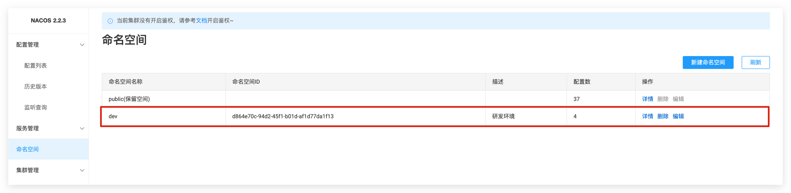
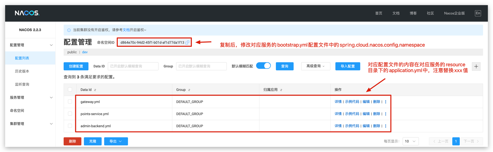

<h1 align="center">DataLoom</h1>
<p align="center"><strong>DataLoom是一个为用户提供智能化、可视化的数据治理与分析平台 🛠</strong></p>
<div align="center">
<a target="_blank" href="https://github.com/Hardork/hwqbi-backend">
    
</a>
<a target="_blank" href="https://github.com/Hardork/hwqbi-backend">
    
</a>
    
<a target="_blank" href="https://www.oracle.com/technetwork/java/javase/downloads/index.html">
        
</a>
    
<a href="https://github.com/Hardork/hwqbi-backend" target="_blank">
    
</a>
</div>

> 作者：[Hardork](https://github.com/Hardork)
> 贡献者：[RookieeZhang](https://github.com/RookieeZhang)
> 项目问题通过下面的联系方式进行沟通
> 邮箱：hardork@163.com
> WX号: _hardork

## 项目背景
<strong>
    传统数据可视化平台存在一些明显的缺点，例如需要用户具备一定的技术知识，因此对用户的技术要求较高。一次完整的数据可视化过程包括数据清洗、数据分析、数据可视化等多个步骤，操作起来较为复杂。DataLoom区别与传统的数据可视化平台，在用户上传数据源（支持MySQL、API、Excel等），系统即自动从元数据中识别出高价值数据，由LLM大模型进行自动化分析，也可支持用户自定义分析目标。
</strong>


## 项目功能介绍

- **多数据源上传**，用户将不同的数据源数据导入系统中，转换为统一存储格式,后续可利用手动联表或自定义SQL的方式进行数据提取
- **数据协同**，用户可将生成的数据集共享给其他用户，实现数据的协作开发和共同分析，提升团队效率。
- **智能化生成数据集**，：DataLoom 通过 LLM 模型，自动分析用户上传的数据源元数据，识别高价值信息，并根据用户的分析需求生成数据预览，支持保存为数据集，进一步简化数据处理过程。
- **智能化看板**，基于自动化的数据分析，DataLoom 可以生成高度定制化的可视化看板，帮助用户快速获取关键洞察。
- **积分获取与消费**，用户在平台上完成特定任务可以获得积分，积分可用于兑换服务或功能，增加用户互动性与粘性。
- **优惠券模块**，平台通过优惠券系统，提供各种折扣和奖励，鼓励用户参与并增加活跃度，支持折扣券、免费服务券、双倍积分券等多种类型的优惠。


## 项目选型 🎯

### **后端**
- Spring Boot 2.7.0
- Spring MVC
- Spring Cloud Alibaba 2021.0.4.0
- Nacos 注册、配置中心
- MySQL 数据库
- RocketMQ 消息队列
- xxl-job 分布式定时任务调度
- Redis 缓存
- WebSocket 双向通信
- 腾讯云COS存储
- Swagger + Knife4j 接口文档
- Jakarta.Mail 邮箱通知、验证码
- Apache Commons Lang3 工具类
- MyBatis-Plus 及 MyBatis X 自动生成
- Hutool、Apache Common Utils 等工具库

### 前端

- React 18

- Ant Design Pro 5.x 脚手架

- Ant Design & Procomponents 组件库

- Umi 4 前端框架

- OpenAPI 前端代码生成
## 网站导航 🧭
Github：
- [**DataLoom 后端 🏘️**](https://github.com/Hardork/hwqbi-backend)
- [**DataLoom 前端 🏘**️](https://github.com/Hardork/hwqbi-frontend)

Gitee:
- [**DataLoom 后端 🏘️**](https://gitee.com/huang-wenqing-123/DataLoom)

## 目录结构 📑

### 外层目录

| src目录                                                         | 描述          |
|---------------------------------------------------------------|-------------|
| **[admin-backend](./admin-backend)**                          | 后台管理服务      |
| **[db-engine](./db-engine)**                                  | 数据引擎服务      |
| **[framework](./framework)**                                  | 项目公共模块      |
| **[gateway](./gateway)**                                      | 网关服务        |
| **[points-service](./points-service)**                        | 积分与优惠券服务    |

### src/main/java 内层目录
| src目录                                                         | 描述          |
|---------------------------------------------------------------|-------------|
| **[annotation](./src/main/java/com/hwq/dataloom/annotation)** | 自定义注释目录     |
| **[aop](./src/main/java/com/hwq/dataloom/aop)**               | aop目录       |
| **[dataloomzmq](./src/main/java/com/hwq/dataloom/bizmq)**     | 消息队列目录      |
| **[common](./src/main/java/com/hwq/dataloom/common)**         | 公共模块目录      |
| **[config](./src/main/java/com/hwq/dataloom/config)**               | 公共配置目录      |
| **[constant](./src/main/java/com/hwq/dataloom/constant)**           | 常量目录        |
| **[controller](./src/main/java/com/hwq/dataloom/controller)**       | 接口目录        |
| **[exception](./src/main/java/com/hwq/dataloom/exception)**         | 自定义异常目录     |
| **[job](./src/main/java/com/hwq/dataloom/job)**                     | 定时任务目录      |
| **[manager](./src/main/java/com/hwq/dataloom/manager)**             | 服务、中间件目录    |
| **[mapper](./src/main/java/com/hwq/dataloom/mapper)**               | mapper目录    |
| **[model](./src/main/java/com/hwq/dataloom/model)**                 | 模型目录        |
| **[service](./src/main/java/com/hwq/dataloom/service)**             | service目录   |
| **[utils](./src/main/java/com/hwq/dataloom/utils)**                 | 工具包目录       |
| **[websocket](./src/main/java/com/hwq/dataloom/websocket)**         | websocket目录 |

## 架构设计与项目核心流程 🗺️

### 架构设计

### **智能化生成数据集**

### AI分析服务


## 快速启动 🚀

### 前端

环境要求：Node.js >= 16

安装依赖：

```bash
yarn or npm install
```

启动：

```bash
yarn run dev or npm run start:dev
```

部署：

```bash
yarn build or npm run build
```

### 后端
请确保你包含以下中间件：
- MySQL
- RabbitMQ
- Redis
- XXL-JOB
- Nacos

1. 执行sql目录下create_table.sql、create_datasource_database.sql
2. 替换配置文件application.yml中打上xxx的属性值
3. 将在nacos中创建命名空间dev

4. 在nacos配置管理的配置列表中新增配置文件

5. 添加启动环境变量，nacos-server = xxx.xxx.xxx.xxx(nacos地址)


## 协议
[MIT](https://choosealicense.com/licenses/mit)

## 源码贡献
如果你发现项目中的任何问题或错误，或者想要对项目进行改进，可以通过以下方式报告问题或提交Pull Request：

- 打开一个Issue，详细描述你的问题或需求。
- 如果你有修复问题的代码，可以创建一个Pull Request，在新分支上修改代码，并将代码合并到主分支。

感谢你对项目的贡献！


